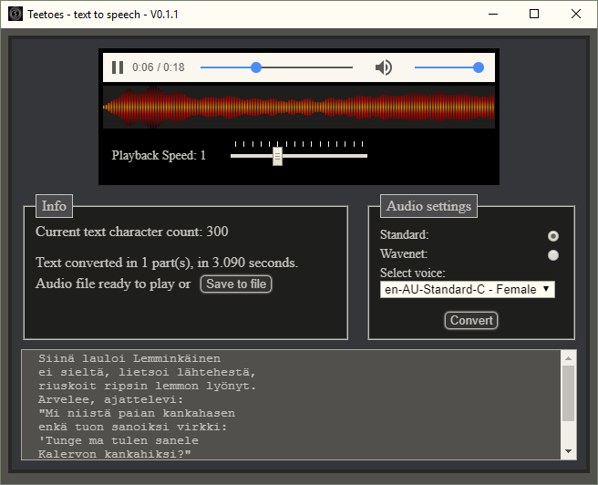

### Teetoes text to speech  

Electron desktop app to convert text to speech.

#### Features
* Uses google cloud api to convert text to speech (quite fast and good voices)
* Several languages and voices available
* You can just play the file straight up or save it to your computer for later listening.
* Beautiful voice visualization to go with the synthetic voices.

<!--
The current API usage limits for the Text-to-Speech API are as follows (and are subject to change):

Requests per minute:	300
Characters per minute:	150,000

Pricing Table (monthly)
Standard (non-WaveNet) voices	0 to 4 million characters free, then $4.00 USD / 1 million characters
WaveNet voices	0 to 1 million characters	free, then $16.00 USD / 1 million characters
30+ voices in 14 languages 
-->
